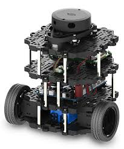
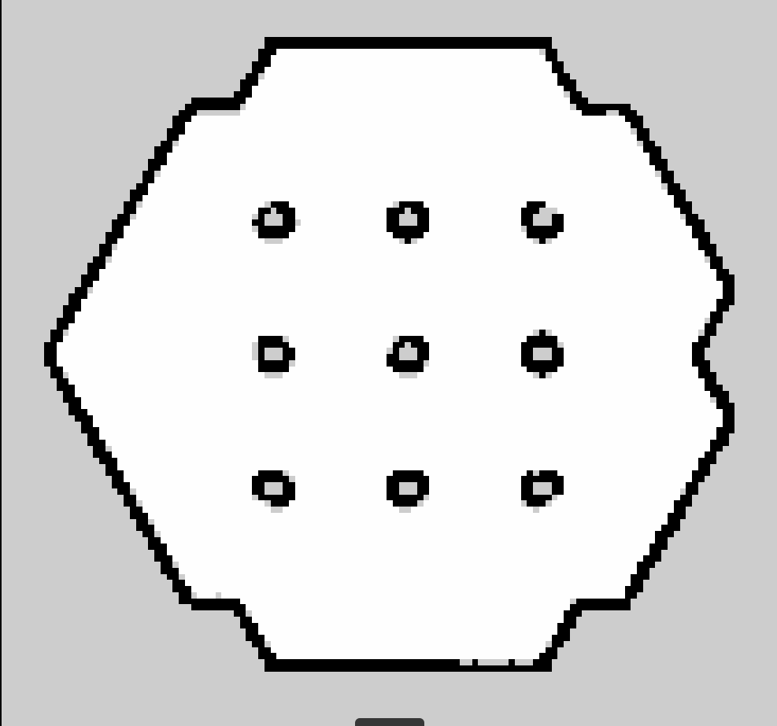
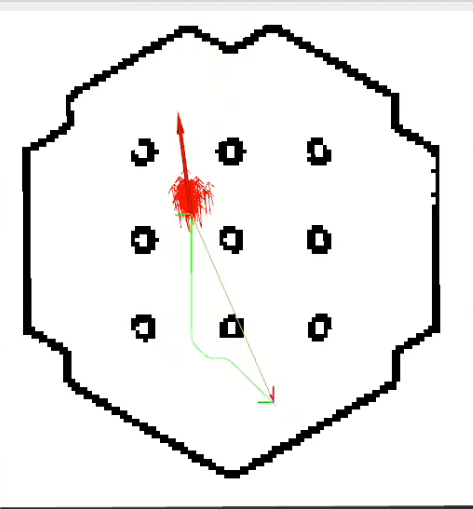

# Integrating_SLAM_and_Path_Planning-using-ROS-2

This project implements a complete indoor navigation system for a differential drive robot using **Robot Operating System 2 (ROS 2)**. The system integrates Simultaneous Localization and Mapping (SLAM), global path planning with A*, and motion control through a state feedback controller. The TurtleBot3 Burger robot is used within the Gazebo simulator, with RViz providing real-time visualization and interaction.

---

## 🧠 Project Overview

The system is designed to:
- Create a 2D occupancy grid map (Cartographer)
- Localize the robot in the map (AMCL)
- Plan global paths using A* algorithm
- Control the robot using a unicycle-model-based state feedback controller

---

## 🚀 Features

- ✅ **SLAM with Cartographer**: builds a 2D map using LIDAR and odometry.
- ✅ **Localization with AMCL**: custom implementation using particle filtering.
- ✅ **Global Path Planning with A***: safe, optimized path generation.
- ✅ **Motion Control**: smooth path tracking using a state feedback controller.
- ✅ **Simulation Support**: tested in Gazebo with RViz visualization.

---

## 📦 System Architecture

The following diagram shows the ROS 2 node and topic structure used for the navigation stack:

---

## 🤖 Robot Platform

The system was tested using the TurtleBot3 Burger in simulation:

---

## 🗺️ SLAM Mapping with Cartographer

Cartographer builds a 2D occupancy grid map from LIDAR and odometry data:

---

## 🎯 Localization with AMCL

AMCL uses a particle filter to estimate the robot's position based on laser scans and odometry:

.png)

---

## 🧭 Path Planning with A* Algorithm

The global planner generates safe, optimal paths:

---

## 🛞 Path Tracking with State Feedback Controller

The controller ensures smooth, accurate path following:

---

## 🖥️ Tools and Technologies

- **ROS 2 (Foxy/Humble)**
- **Gazebo** simulator
- **RViz 2** for visualization
- **TurtleBot3 Burger**
- **Python & C++** (custom ROS 2 nodes)

